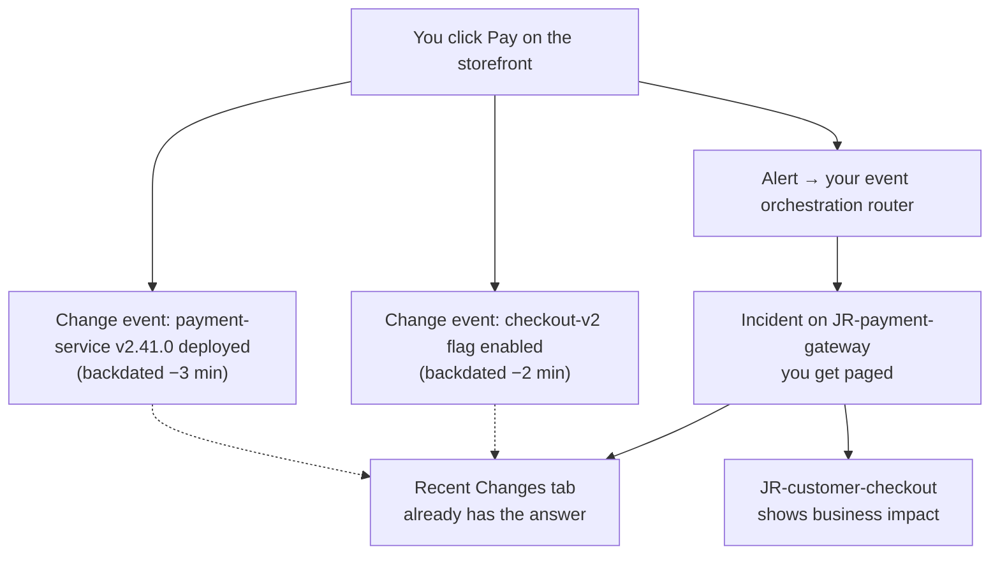

<div align="center">

# Greenagonia

**A complete, realistic PagerDuty demo environment — built in one command.**

Fictional outdoor-gear company. Real incidents. Break the checkout on a live
storefront and watch PagerDuty light up: change events, orchestration,
paging, business impact — the full story.


[Quick start](#quick-start) ·
[The demo](#the-demo) ·
[What you get](#what-each-admin-gets) ·
[Hosting](#hosting-the-storefront) ·
[Full guide](ADMIN-GUIDE.md)

</div>

---

## Why

Demo environments are usually either empty shells or hand-built snowflakes.
Greenagonia deploys a believable company into a real PagerDuty account —
teams, on-call schedules with fictional teammates covering nights and
weekends, 8 microservices, business services, event orchestration — and pairs
it with a storefront whose checkout fails on demand.

- 🟢 **One shared account, many private stacks** — every admin gets their own
  services, routing key, and schedule; run 10 demos at once from one site
- 🟢 **The "what changed?" moment, built in** — backdated deploy and feature-flag
  change events land minutes before the incident
- 🟢 **Nothing to babysit** — stable dedup keys mean no incident floods;
  add or remove an admin without touching anyone else's stack

---

## Quick start

```bash
git clone https://github.com/justynroberts/greenagonia.git
cd greenagonia
./get-binary.sh                   # downloads the right binary for your OS
./greenagonia setup               # guided setup: token, region, first admin
./greenagonia deploy              # builds everything in PagerDuty (~2 min)
./greenagonia urls                # get your personal storefront link
```

Open the link, click **Pay**, watch the incident land in PagerDuty.

> **Need Terraform?** `brew install terraform` on macOS. Linux: `install.sh` handles it.

---

## The demo



1. Open your `?pdkey=` storefront link — the routing key saves to the browser and vanishes from the URL bar
2. Click **Pay** — the checkout pipeline runs five stages and fails at payment
3. The incident opens with the *Recent Changes* tab already answering "what changed just before this broke?"
4. Click Pay again — same incident, no duplicates
5. Resolve from PagerDuty, or hit **Resolve all** in the hidden ops console (`Ctrl/Cmd+Shift+K`)

---

## What each admin gets

| Resource | Example (initials: `JR`) |
|---|---|
| PagerDuty user | your real name + email — gets paged |
| Team | `JR-SRE-TEAM` |
| 8 microservices | `JR-payment-gateway`, `JR-checkout-api`, `JR-user-auth` … |
| 2 business services | `JR-customer-checkout`, `JR-product-discovery` |
| On-call schedules | Primary (you, Mon–Fri 9–5) + Secondary/Tertiary (fictional personas) |
| Event orchestration | Personal routing key → your services |
| Slack (optional) | `#jr-incidents` + PagerDuty connection |

Five fictional teammates staff nights, weekends, and backup rotations so the
account looks like a real company. Each admin's stack is **invisible to other
admins** — multiple demos run simultaneously from the same storefront.

---

## Commands

<details>
<summary><strong>Full CLI reference</strong></summary>

```bash
# First run
./greenagonia setup

# Tokens
./greenagonia token                        # PagerDuty REST API token
./greenagonia user-token                   # user-level token (Slack)
./greenagonia slack-token                  # Slack bot token

# Admins
./greenagonia admin add JR "Jo Roberts" jo@example.com
./greenagonia admin remove JR
./greenagonia admin list

# Deploy
./greenagonia deploy
./greenagonia destroy

# Links
./greenagonia urls                         # all admins
./greenagonia urls JR                      # one admin
./greenagonia site-url https://mysite.com  # set storefront URL

# Scenarios
./greenagonia scenarios list
```

</details>

---

## Hosting the storefront

Plain HTML/CSS/JS — no build step.

```bash
# Local
cd site && python3 -m http.server 8080

# Docker / nginx (included docker-compose.yml)
docker compose up -d

# Shared (host site/ anywhere, then register the URL)
./greenagonia site-url https://demo.example.com
./greenagonia deploy && ./greenagonia urls
```

---

## Installing

| Method | Command |
|---|---|
| **Download binary** (recommended) | `./get-binary.sh` — detects macOS arm64/amd64 or Linux amd64/arm64 |
| **Linux global install** | `curl -fsSL https://raw.githubusercontent.com/justynroberts/greenagonia/main/install.sh \| bash` |
| **Build from source** | `make build` (needs Go ≥ 1.25) · macOS: `./quickstart.sh` installs prereqs |

<div align="center">

**[Read the full admin guide →](ADMIN-GUIDE.md)**

</div>
